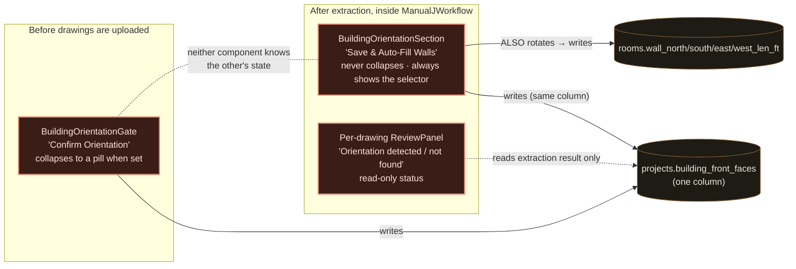

# Summit — Real Order-of-Operations Audit (as implemented, 2026-08-31)

Diagnostic only. No code was changed. This traces what the **residential** pipeline
actually does in execution order, from `projects` insert through PDF, then flags every
duplicated / mis-sequenced / independently-running step, then compares against the
intended spec.

Commercial / industrial projects take a different branch (`components/commercial-workflow.tsx`,
rendered instead of `ProjectWorkspace` when `project_type != 'residential'`); it is
summarised at the end, not fully traced.

---

## Step 3 up front: the reference spec does not exist

**There is no `SUMMIT-BUILD-SEQUENCE.md` in the repository**, and no "ten ordered steps"
or "strict in-order execution rule" in any tracked markdown. Verified by `grep` across all
`*.md` and all of `app/ components/ lib/`. The nearest artifacts are:

| Doc | What it actually specifies |
|---|---|
| `REFERENCE-DOCS/SUMMIT-REPORT-STANDARD.md` | The 12-page report **page** layout, and the **§3 generation gate** conditions (unresolved fields, Manual S per system, Manual D + CFM, totals cross-foot, room-data completeness) |
| `PHASE.md` | Phase tracker (Phase 7 gap list) — not a pipeline |
| Extraction prompt "STEP 1–15" (`lib/drawingExtraction.ts`) | Structure of the **AI prompt** (sheet inventory → walls → attic → ducts → water heaters). Not a project pipeline. |

So Step 3 below compares the live implementation against (a) the §3 gate conditions and
(b) the order the code's own gating logic implies.

---

## Step 1 — The real sequence, in execution order

Legend for "Re-run?": **once** = guarded to run a single time · **manual** = user can
repeat it deliberately · **every load** = happens on every project page view · **reactive**
= recomputed continuously from inputs.

### S0 · Create project
- **Trigger:** user submits the New Project form — `app/dashboard/new/page.tsx`.
- **Writes:** one `projects` row (`name, project_type, address, org_id, created_by`). Nothing else — no climate, envelope, orientation, rooms.
- **Re-run?** manual (each submit is a distinct project row).
- **Depends on:** a `profiles.org_id` for the signed-in user.

### S1 · Load project page  ·  `app/dashboard/[id]/page.tsx` (server component)
Runs on **every load / navigation / `router.refresh()`**:
- `auth.getUser()` → `profiles` (role, org_id) → `projects` select.
- `resolveCounty()` — **external Census geocoder call** — → `climate_zone_reference` select.
- `calculation_snapshots` latest → `latestSnapshot`; `report_sign_offs` (non-superseded).
- If **no snapshot**: 6 `updated_at` probes + `staleness_banner_dismissals` → `computeStaleItems` (staleness banner).
- If residential: **one 20-way `Promise.all`** (rooms, drawings, zones, room_type_defaults, field_resolutions, duct_runs, duct_diffusers, ahu_installation_detail, duct_terminations, duct_sizing_tables, equipment_catalog, equipment_performance_points, equipment_org_preferences, duct_insulation_code_minimums, exhaust_sources, makeup_air_specs, exhaust_fan_specs, dehumidifier_specs, blower_performance, dehumidification_systems) + a sequential `dehumidification_system_rooms` follow-up.
- `countUnresolvedFields(drawings, resolvedKeys)` → the header "**N fields need review**" badge (computed at load only; tooltip text is stale — see Step 3).
- **Renders**, top to bottom: header → Climate Zone panel → `StalenessBanner` → **`GenerateReportsButton`** → `ReportSignOffSection` → `MakeupAirSection` → **`ProjectWorkspace`**.

> `GenerateReportsButton` mounts `ReportGenerationGate`, which **immediately POSTs `/api/reports/gate-status`** → a full `getReportData` recompute (see S13). This happens on every project page load, including a brand-new project with zero rooms.

### S2 · Confirm climate  ·  `components/confirm-climate-button.tsx`
- **Trigger:** user clicks "Confirm Climate Data".
- **Writes:** `projects.climate_confirmed = true`; then `router.refresh()`.
- **Gates:** `BuildingOrientationGate` renders only `if (climateConfirmed)` (`project-workspace.tsx:133`).

### S3 · Confirm building orientation — GATE (pre-extraction)  ·  `components/building-orientation-gate.tsx`
- **Trigger:** user picks a compass direction, clicks "Confirm Orientation". Renders only after S2.
- **Reads/Writes:** `projects.building_front_faces`. Collapses to a green "confirmed" pill once set.
- **Gates:** `DrawingsSection` renders only `if (climateConfirmed && buildingFrontFaces)` (`project-workspace.tsx:143`).
- **Re-run?** once (self-collapses). Changing it later is done in S7b.

### S4 · Upload drawing → extract  ·  `components/drawings-section.tsx` → `app/api/drawings/extract/route.ts`
- **Trigger:** user drops/selects file(s). Per file, sequentially: upload to Storage → insert `drawings` row (`extraction_status:'pending'`) → **immediately** `POST /api/drawings/extract`.
- **Server does:** read `drawings` + `projects.building_front_faces` → download file → `extractPdfPageTexts` (PDF text layer, best-effort) → **Claude streaming call** (prompt keyed on cardinal `knownOrientation`) → JSON parse → ~8 deterministic post-processors (`computeCompassWallLengthsFromPageAxes` when orientation known, `deriveFloorAreaFromPageDimensions`, `applyDuctFallbackDefaults`, `flagWaterHeaterLoadRisk`, `flagRoomCeilingHeightConflicts`, `flagWindowScheduleForVerification`, `verifyEnvelopeConflictDisclaimers`, `flagCeilingInsulationRValueConflicts`) → **conditional second Claude call** (targeted follow-up) → write `drawings.extracted_data` + `unresolved_items` + `extraction_status:'completed'` → insert `drawing_extraction_history` audit row.
- **Client then:** sets status, auto-opens the ReviewPanel for that drawing.
- **Also here:** "Use as report floor plan" sets `drawings.floor_plan_page_number` (clears it on every other drawing first).
- **Re-run?** manual, **unguarded** — re-upload / repeat POST overwrites `drawings.extracted_data` wholesale (history table keeps priors).
- **Depends on:** `projects.building_front_faces` (as prompt context only — missing/intercardinal falls back silently).

### S5 · Field review (the UNRESOLVED workflow)  ·  ReviewPanel in `drawings-section.tsx`
- **Trigger:** user clicks a `FieldResolutionBadge` → Accept, or Override-with-reason.
- **Writes:** one `field_resolutions` row per action (`table_name / record_id / field_name / ai_extracted_value / final_value / resolution_type / override_reason`).
- **Enforced as a hard gate only** in the `summit_standard` report gate (condition 1). The header badge is visibility-only.
- **Re-run?** manual, per field.

### S6 · Apply extracted data to the form  ·  ReviewPanel "Apply to Form" → `ManualJWorkflow.applyExtractedData` (`manual-j-workflow.tsx:943`)
- **Trigger:** user clicks "Apply to Form" / "Re-Apply / Update Form".
- **Reads:** the drawing's `extracted_data`, overlaid with any `field_resolutions` (`resolvedRoom` / `resolvedEnvelopeNumber`).
- **Writes:**
  - `projects` — fills **blank** envelope fields only (R-values, foundation_type, window_type/count; `attic_construction_type` only when `rooms.length === 0`).
  - `rooms` — if `rooms.length === 0`: bulk `insert`. Else: per extracted room, match by normalised name → 0 matches = `insert` new room; 1 match = `update` duct / wall / window / ceiling-height; ambiguous / nameless = skip + note.
  - `exhaust_sources` — draft `pending_review` rows for new Bath/Kitchen rooms (`createDraftLocalExhaustSources`).
  - `drawings.applied_to_field_data = true` (display flag only).
- **Re-run?** manual; the insert-vs-update fork keys entirely on `rooms.length === 0`.
- **Note:** this is the only bridge from extraction to `rooms`. Nothing auto-applies.

### S7 · Manual J  ·  `computeManualJ` — client `useMemo` in `ManualJWorkflow` (`manual-j-workflow.tsx:642`)
- **Trigger:** none — **reactive**. Recomputes on any change to rooms / envelope / zones / design temps.
- **Gated on:** `canCalculate = winterDesignTempF != null && summerDesignTempF != null` (climate row exists).
- **Not persisted anywhere.** Feeds the on-screen Manual J Results + Zone Summary tables and the `equipmentPanels` memo.
- Same section also hosts: **S7b** (orientation, below), Building Envelope form (`handleSaveEnvelope` → `projects`), Zones CRUD (`zones`), Rooms CRUD (`rooms` via `RoomForm`).

### S7b · Confirm building orientation — SECTION (post-extraction)  ·  `components/building-orientation-section.tsx` (`manual-j-workflow.tsx:1237`)
- **Trigger:** user re-selects a direction, clicks "**Save & Auto-Fill Walls**". Always rendered at the top of `ManualJWorkflow`, regardless of whether S3 is done.
- **Writes:** `projects.building_front_faces` (**same column S3 writes**), then — the part S3 does *not* do — for every room not blocked by `roomHasUnresolvedWallOrientation`, `applyOrientationToRoom` → `rooms.update` of the cardinal `wall_north/south/east/west_len_ft` fields.
- **Re-run?** manual, repeatedly.
- **This is the "asked more than once" the user is seeing** — see Step 2, Finding A.

### S8 · Manual D  (multi-step, mixed persistence)  ·  `components/duct-design-section.tsx` + `components/duct-routing-canvas.tsx`
- **S8a — Duct-design settings:** ASP calculator (TESP + evaporator + filter + grille losses → computed available static pressure), `supply_air_temp_f`. → `projects.update`. Manual.
- **S8b — Routing pins:** `DuctRoutingCanvas` — place / drag / confirm one pin per conditioned room, plus per-zone AHU, return-air, and condenser pins, over the live-rendered drawing page (`/api/drawings/[id]/page-image`). Each confirm → `rooms.update(position_*)` or `zones.update(*_position_*)` **+ a `field_resolutions` row** (`accepted` / `overridden`). Manual, per pin.
- **S8c — Auto-generate from pins:** `handleAutoGenerateFromPins` — **gated on `ductRoutingGate.ready`** (all pins resolved). Derives per-sheet real scale (`resolveSheetScale` from rooms with both a printed dim and a pin), `computeRoutedBranchRun` per room → **upserts** one branch `duct_runs` row per room + one trunk `duct_runs` per zone. Re-runnable (updates lengths).
- **S8d — Manual entry:** duct runs, diffusers, terminations, AHU install detail → `duct_runs`, `duct_diffusers`, `duct_terminations`, `ahu_installation_detail`.
- `computeManualD` itself runs **(1)** live in `DuctDesignSection` for the on-screen schedule and **(2)** server-side in `getReportData` on the persisted `duct_runs`.

### S9 · Dehumidification (optional)  ·  `components/dehumidification-section.tsx`
- → `dehumidification_systems`, `dehumidification_system_rooms`, and dehumidification-parented `duct_runs` (same table as S8, disjoint by `dehumidification_system_id`).

### S10 · Preferred manufacturer / system configuration
- `PreferredManufacturerSection` → `projects.preferred_manufacturer` (shown only if the catalog has ≥1 manufacturer).
- `SystemConfigurationSection` → `projects.hvac_system_configuration` (shown only if `zones.length > 1`). Changes whether S11 is one panel per zone or one combined panel.

### S11 · Manual S  ·  `components/equipment-selection-section.tsx` (one panel per real zone, or one combined)
- **Client:** `evaluateEquipment` / `rankEquipment` for the on-screen picker (respects preferred / exclusive manufacturer).
- **Trigger:** user clicks "Select" on a unit → `zones.update({selected_equipment_id, equipment_selection_notes})` (+ `selected_air_handler_equipment_id`). In `single_system_zoned` mode the same value is written to every zone in the group.
- **Server:** `getReportData` re-runs `evaluateEquipment` / `rankEquipment` per zone at gate / report time.
- **Persisted artifact:** the human's pick only (`zones.selected_equipment_id`).

### S12 · Makeup air / local exhaust  ·  `components/makeup-air-section.tsx` (rendered by `page.tsx`, **above** `ProjectWorkspace`)
- → `exhaust_sources`, `projects.selected_makeup_air_equipment_id`. Draft `exhaust_sources` also created back in S6.

### S13 · Report-readiness gate check  ·  `components/report-generation-gate.tsx` → `app/api/reports/gate-status/route.ts`
- **Trigger:** `useEffect` keyed on `[projectId]` — fires **once on component mount** (i.e. once per page load).
- **Server:** `getReportData` (full **J + D + S per zone + N + install-package** recompute, ~25 queries, + geocode) → `getReportGenerationGateStatus`:
  1. `countUnresolvedFields > 0`
  2. every zone-with-rooms has a complete Manual S selection (make/model + interpolated capacity)
  3. every conditioned room has a branch `duct_run`; per-zone branch CFM vs. selected equipment rated CFM within 15% (grouped by shared unit in `single_system_zoned`)
  4. `validateReportTotals` cross-foots
  5. `checkDataCompleteness(rooms)` (floor area present, whole-house glazing non-zero, …)
- Returns a checklist; `onReady(canGenerate)` enables/disables the button.
- **Does not re-check** when a blocker is fixed elsewhere in the session — see Finding D.

### S14 · Generate report + freeze snapshot  ·  `app/api/reports/route.ts`  (`POST {projectId, type, version?}`)
- If `type === 'summit_standard'`: run `getReportGenerationGateStatus` on **live** `getReportData`; `!canGenerate` → **422**.
- If `type === 'internal'` or `'client'`: **no gate.**
- `getOrCreateSnapshot`: existing snapshot → return it (frozen). None → `getReportData` → `attachFrozenImages` (Puppeteer-rasterise Floor Plan + duct-routing PNGs into `snapshot_data`) → insert `calculation_snapshots` **v1**.
- Render HTML (`reportHtmlV2` for summit_standard, `reportTemplates` for internal/client) → Puppeteer → PDF download.
- **The first report of any of the three types freezes v1.** After that, all PDFs render from the frozen `snapshot_data`.

### S15 · Revision  ·  `app/api/reports/revise/route.ts`  (`POST {projectId, reason}`)
- Requires an existing snapshot + non-empty `reason`. → `getReportData` fresh + `attachFrozenImages` → insert `calculation_snapshots` vN+1.
- **No gate check.**

### S16 · Licensed sign-off (parallel, post-snapshot)  ·  `components/report-sign-off-section.tsx`
- Attaches a `report_sign_offs` row to a **specific frozen version**. Not a generation gate; rendered as a banner on every PDF page.

---

## Step 2 — Duplicated / mis-sequenced / independently-running operations

### ▲ A — Building-orientation confirmation is built twice  (the reported symptom)

| | **S3 — `BuildingOrientationGate`** | **S7b — `BuildingOrientationSection`** |
|---|---|---|
| File | `components/building-orientation-gate.tsx` | `components/building-orientation-section.tsx` |
| Position | In `ProjectWorkspace`, **before** `DrawingsSection` | Inside `ManualJWorkflow`, **after** extraction, further down the same page |
| Question shown | "Confirm which compass direction the front exterior elevation faces" + "Confirm Orientation" | "Which compass direction does the front entry face?" + "**Save & Auto-Fill Walls**" |
| Writes | `projects.building_front_faces` | `projects.building_front_faces` **(same column)** + `rooms.wall_*_len_ft` rotation |
| Collapses when set? | **Yes** — green pill | **No** — full selector + button always render; only the extra gold *banner* is suppressed (`showBanner = pendingRooms.length > 0 && !initialBuildingFrontFaces`) |

- **What the user sees:** confirm orientation in the Gate to unlock drawing upload; upload the set; scroll down; the same "which way does the building face" question is presented again, as an open action.
- **Is it duplication or a state bug?** **Genuine architectural duplication** of the confirmation UI and the `building_front_faces` write. It is *not* a state-tracking bug — `building_front_faces` is read consistently everywhere (extraction route, report, both components), and the Section's selector is pre-filled with the saved value. The Gate was retrofitted on 2026-08-15 (see its header comment) in front of the pre-existing Section; the Section was deliberately kept because it *also* runs the per-room wall-rotation transform, which the Gate does not. Neither component references the other's completion state.
- **Third surface:** each drawing's ReviewPanel shows a read-only "Orientation detected / No orientation marker found" box (`drawings-section.tsx:529`) during the same flow.
- **Net:** one fact (`building_front_faces`) has two full editing surfaces plus one status surface, straddling the drawing-upload step. Only S7b does anything S3 doesn't (the room transform).

### ▲ B — The first report of *any* type freezes the snapshot, but only `summit_standard` is gated

- `app/api/reports/route.ts:149` runs the gate **only** for `type === 'summit_standard'`. `internal` and `client` go straight to `getOrCreateSnapshot` (`route.ts:183`), which inserts `calculation_snapshots` v1 if none exists. `generate-reports-button.tsx:83` states the intent plainly: *"The first download of any type finalizes version 1 server-side."*
- `SUMMIT-REPORT-STANDARD.md` §3 (quoted in `route.ts:142`) requires generation to *"wait until everything is genuinely final: freezing early would freeze an incomplete project."* Enforced for 1 of 3 entry points.
- **Failure scenario:** an estimator downloads the Internal Engineering Report to sanity-check numbers on an in-progress project → v1 freezes from incomplete live data. Later they finish the project; the `summit_standard` gate now runs against **live** `getReportData` and passes; the checklist shows "✓ Ready"; but `getOrCreateSnapshot` returns the **stale** v1 and the PDF renders the early freeze. Only an explicit S15 revision refreshes it.

### ▲ C — `/api/reports/revise` creates a new frozen version with no gate

- `revise/route.ts` requires a prior snapshot + a reason, then inserts vN+1 from fresh `getReportData` (`:53–74`). It never calls `getReportGenerationGateStatus`.
- Combined with B: the §3 gate is enforced **only on the very first `summit_standard` generation** — never on internal/client first-generation, never on any revision.

### ▲ D — The readiness checklist is computed once per page load and never refreshed in-session

- `report-generation-gate.tsx:40` — `useEffect(… , [projectId])`. Fires once.
- Every blocker it can report is fixed in a **sibling component with its own state**: `EquipmentSelectionSection` (S11), `DuctDesignSection` (S8), the ReviewPanel (S5), the room forms (S7). None notify the gate.
- **Failure scenario:** tech resolves the last blocker in `DuctDesignSection`; the checklist still says "1 thing blocking"; "Generate Summit Standard Report" stays disabled (`generate-reports-button.tsx:201`) until a full page reload. Conversely, introducing a blocker after the gate loaded green leaves the button enabled — only the server-side gate (S14, live) catches it.
- **Classification:** state-tracking gap, not duplication.

### ▲ E — `getReportData` (full J + D + S + N + install recompute) runs on every project page load

- Callers: `gate-status` route (mount of `ReportGenerationGate` — every project page view), `reports` route (S14), `revise` route (S15).
- Each call: ~25 Supabase queries + `computeManualJ` + `computeManualD` + `evaluateEquipment`/`rankEquipment` per zone + `computeInstallPackage` + `resolveCounty`/`resolveLatLong` geocode.
- A brand-new residential project with zero rooms still triggers the whole aggregation on page load.
- **Classification:** not a duplicate *write*, but the same expensive derivation is re-run speculatively on every page view with no "is this project even started" pre-check and no cached/persisted J/S result to short-circuit it.

### ▲ F — Manual J and Manual S each compute in two places every session (by design)

- **Manual J:** `computeManualJ` in `ManualJWorkflow` (client `useMemo`, for the on-screen tables) **and** in `getReportData` (server, for the gate + snapshot).
- **Manual S:** `evaluateEquipment` / `rankEquipment` in `EquipmentSelectionSection` (client, for the picker) **and** in `getReportData` (server).
- The calc functions are pure and shared, so the two evaluations agree. The only persisted Manual S artifact is `zones.selected_equipment_id`; Manual J has no persisted artifact until the snapshot. Deliberate SSR/CSR split — listed because the request asks for every place a step runs.

### ▲ G — Drawing extraction has no re-run guard; overwrites `extracted_data` wholesale

- `drawings-section.tsx:120` fires `POST /api/drawings/extract` immediately on every upload. Any repeat overwrites `drawings.extracted_data` / `unresolved_items` (`extract/route.ts:392`). `drawing_extraction_history` keeps priors.
- `field_resolutions` are keyed by `drawings.id` + `room[<index>]` / field name, and by normalised room name for wall orientation. A re-extraction that **renumbers or renames rooms** can strand existing resolutions against the new indices/names.
- `applied_to_field_data` is display-only and does not prevent re-Apply.
- **Classification:** re-runs are a supported action; the gap is that nothing warns when a re-run will diverge from prior human resolutions.

### ▲ H — Steps that unlock on a prerequisite being *started/any-value*, not *valid/complete*

- **Drawing upload unlocks on any `building_front_faces` value, including intercardinal.** `project-workspace.tsx:143` gates only on truthiness. The extraction route then can't use NE/SE/SW/NW as a compass fact (`isCardinalCompass`, `extract/route.ts:128`) and silently falls back to the no-orientation prompt. The Gate's own copy warns about this but still lets it through and still unlocks S4.
- **The `summit_standard` gate reads live data while the PDF renders frozen data** (Finding B) — the check and the artifact are not looking at the same thing.
- **A snapshot can freeze with no floor plan.** `attachFrozenImages` runs whether or not `drawings.floor_plan_page_number` was ever set; if it wasn't, the report page is blank and the gate does not flag it.

---

## Step 3 — Deviations from the intended sequence

Because `SUMMIT-BUILD-SEQUENCE.md` is absent, this compares against the §3 gate spec and the code's implied ordering.

| # | Intended (per `SUMMIT-REPORT-STANDARD.md` §3 / doc language) | Live implementation | Kind |
|---|---|---|---|
| 1 | Generation gate must pass **before** the snapshot is frozen ("freezing early would freeze an incomplete project") | Gate runs only for `summit_standard`; `internal` / `client` freeze v1 with no gate (**B**) | Bug / unreconciled shortcut |
| 2 | Legitimate corrections create a new gated, dated, reasoned version | `revise` creates vN+1 with a reason but **no gate** (**C**) | Bug |
| 3 | The readiness checklist reflects the project's current state | Checklist is a one-shot on mount; goes stale as blockers are fixed in-session (**D**) | Bug (state tracking) |
| 4 | "Building orientation is already confirmed for this ENTIRE review" (`drawingExtraction.ts:658`) — implies **one** confirmation point | Two full confirmation surfaces (S3 before extraction, S7b after) + a status box per drawing (**A**) | Duplication (partly intentional — S7b also does the room transform — never reconciled into one UI) |
| 5 | Header "N fields need review" badge tooltip: *"No finalize/export feature exists yet to block on this — it's visibility only for now"* (`page.tsx:1003`) | The §3 gate **does** now block on unresolved fields | Stale doc/comment |
| 6 | Manual J → Manual S → Manual D is the ACCA order | Live UI renders **Manual D (S8) before Manual S (S11)**; both are reactive off the same `computeManualJ` memo so the numeric dependency still holds, but the on-screen order and the gate's per-zone checks assume equipment may not be picked yet when ducts are generated | Order deviation (works, but the CFM-compatibility gate exists precisely because ducts can be generated before equipment is chosen) |

Matches on **what** the gate checks (unresolved fields, Manual S per zone, Manual D + CFM, totals, room completeness) — deviates on **when** it is applied.

---

## Diagram — actual order of operations, with flags

```mermaid
flowchart TD
    classDef normal fill:#1e1b15,stroke:#8a6636,color:#ece6d9
    classDef dup fill:#3a1d17,stroke:#e0846f,color:#ffe3d9,stroke-width:2px
    classDef nogate fill:#3a2a12,stroke:#e0b060,color:#ffeccb,stroke-width:2px
    classDef stale fill:#132a2a,stroke:#66c0c0,color:#d6f2f2,stroke-width:2px
    classDef spec fill:#241a2e,stroke:#b98fd0,color:#efe0f7,stroke-width:2px

    S0["S0 · Create project<br/><small>user submit → projects insert</small>"]:::normal
    S1["S1 · Load project page (server)<br/><small>every load: 20-way Promise.all + geocode</small>"]:::normal
    GATECHK["S13 · /api/reports/gate-status<br/><small>fires on mount, once per page load</small>"]:::stale
    S1 -. "mounts ReportGenerationGate" .-> GATECHK
    GATECHK -. "full getReportData recompute<br/>even on empty project" .-> RD

    S0 --> S1 --> S2["S2 · Confirm climate<br/><small>user click → projects.climate_confirmed</small>"]:::normal
    S2 -- "gates render" --> S3["S3 · Confirm orientation — GATE<br/><small>user click → projects.building_front_faces</small>"]:::dup
    S3 -- "gates render (any value,<br/>incl. intercardinal)" --> S4["S4 · Upload drawing → extract<br/><small>auto on upload · 1–2 Claude calls</small>"]:::nogate
    S4 -- "auto-open review" --> S5["S5 · Field review (UNRESOLVED)<br/><small>user per field → field_resolutions</small>"]:::normal
    S5 --> S6["S6 · Apply to Form<br/><small>user click → rooms + projects + exhaust_sources</small>"]:::normal
    S4 -. "re-upload overwrites<br/>extracted_data, may strand<br/>field_resolutions" .-> S4

    S6 --> S7["S7 · Manual J<br/><small>client useMemo · reactive · not persisted</small>"]:::spec
    S7 --> S7B["S7b · Confirm orientation — SECTION<br/><small>same projects.building_front_faces write<br/>+ rooms wall rotation · Save &amp; Auto-Fill Walls</small>"]:::dup
    S3 -. "SAME COLUMN, two surfaces,<br/>before &amp; after S4" .-> S7B

    S7B --> S8["S8 · Manual D<br/><small>8a settings → 8b pins (+field_resolutions)<br/>→ 8c auto-gen duct_runs (gated on pins)<br/>→ 8d manual entry</small>"]:::normal
    S8 --> S9["S9 · Dehumidification (optional)"]:::normal
    S9 --> S10["S10 · Preferred mfr / system config<br/><small>projects.preferred_manufacturer / hvac_system_configuration</small>"]:::normal
    S10 --> S11["S11 · Manual S<br/><small>client picker → zones.selected_equipment_id<br/>(rendered AFTER Manual D)</small>"]:::spec
    S12["S12 · Makeup air / exhaust<br/><small>rendered above ProjectWorkspace</small>"]:::normal
    S1 --> S12

    S7 -. "computeManualJ ALSO runs here" .-> RD
    S11 -. "evaluateEquipment ALSO runs here" .-> RD
    S8 -. "computeManualD ALSO runs here" .-> RD

    S11 --> RD["getReportData<br/><small>full J + D + S/zone + N + install recompute<br/>from live tables · ~25 queries</small>"]:::spec

    RD --> S14CHK{"S14 · POST /api/reports<br/>type?"}:::normal
    S14CHK -- "summit_standard" --> GATE["run §3 gate on LIVE data"]:::normal
    S14CHK -- "internal / client" --> NOGATE["NO gate"]:::nogate
    GATE -- pass --> SNAP
    NOGATE --> SNAP["getOrCreateSnapshot<br/><small>first call of ANY type freezes v1<br/>+ attachFrozenImages (Puppeteer)</small>"]:::nogate
    GATE -- "fail" --> BLK["422 + blockers"]:::normal
    SNAP --> PDF["Puppeteer → PDF download"]:::normal

    SNAP -. "later edits ignored until…" .-> S15["S15 · POST /api/reports/revise<br/><small>reason required · NO gate</small>"]:::nogate
    S15 --> SNAP
    PDF --> S16["S16 · Licensed sign-off<br/><small>report_sign_offs → frozen version · parallel, not a gate</small>"]:::normal

    subgraph LEGEND [" "]
        direction LR
        L1["duplicate / two surfaces"]:::dup
        L2["runs with no gate"]:::nogate
        L3["stale in-session state"]:::stale
        L4["speculative / repeated recompute"]:::spec
    end
```

### The orientation duplication, isolated

---

## Commercial / industrial branch (not fully traced)

`page.tsx` renders `CommercialWorkflow` instead of `ProjectWorkspace` when `project_type != 'residential'`.
It has its own zones (`zones` with commercial columns), `computeCommercialBlockLoad` / `computeIndustrialBuildingLoad`,
`process_loads`, and an 8760-hour NOAA simulation path. The report gate's `data.residential` block is skipped
for these; only conditions 1 (unresolved fields) and 4 (totals) apply. S3/S7b orientation, S8 Manual D pins, and
S11 Manual S panels do **not** appear in this branch. Worth its own trace if commercial projects are in scope.

---

*Generated 2026-08-31 · diagnostic only · no code changed · `lib/pdfRoomGeometry.ts` build-4 changes remain uncommitted and untouched.*
